# nopass — system architecture

Every moving part of nopass, how they connect, and the decisions that put them
in that shape. Diagrams are Mermaid and render on GitHub.

This file is the *map*. [`docs/adr/`](docs/adr/README.md) is the *why* in full;
[`docs/architecture/README.md`](docs/architecture/README.md) is the browser
bridge in detail; [`README.md`](README.md) is the user's view.

**Keep it current.** Anything that changes a boundary — a new crate or package,
a new verb on the wire, a new trust edge, a new ADR — changes a diagram here.

- [1. The whole system](#1-the-whole-system)
- [2. Repository topology](#2-repository-topology)
- [3. The store on disk](#3-the-store-on-disk)
- [4. Identity, slots and crypto](#4-identity-slots-and-crypto)
- [5. Unlocking and the agent](#5-unlocking-and-the-agent)
- [6. The CLI](#6-the-cli)
- [7. The wire between browser and host](#7-the-wire-between-browser-and-host)
- [8. Inside the extension](#8-inside-the-extension)
- [9. The three flows that matter](#9-the-three-flows-that-matter)
- [10. Who may be offered what](#10-who-may-be-offered-what)
- [11. Trust boundaries](#11-trust-boundaries)
- [12. The decision log](#12-the-decision-log)
- [13. Build, test, release](#13-build-test-release)
- [14. Invariants](#14-invariants)

---

## 1. The whole system

One engine, three front ends, one unlock state shared between them.

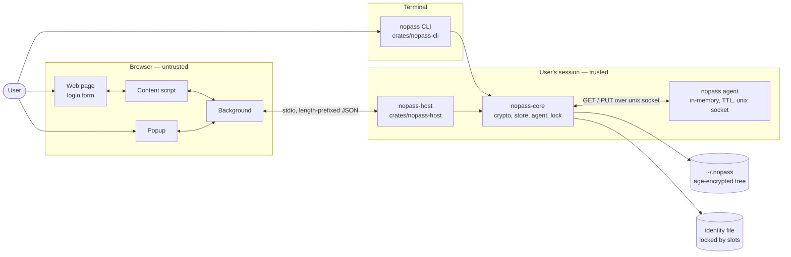

The extension is the only untrusted component that ships in this repository.
It never holds an identity, never sees the store directory, and cannot decrypt
anything itself. The host is trusted exactly as much as the CLI, because it is
the same library with a different mouth.

---

## 2. Repository topology

Two build graphs in one repository: Cargo for Rust, Bun workspaces plus Turborepo
for JavaScript, with Turbo wrapping the Cargo commands so one command at the
root runs both (ADR-0004).

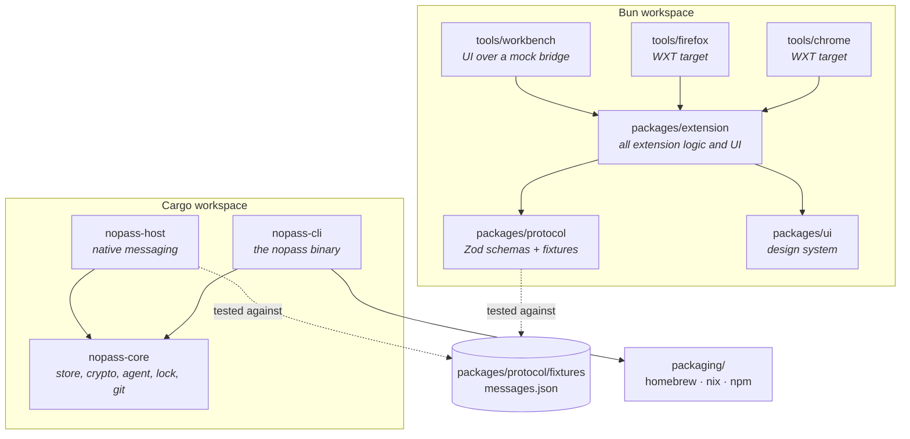

| Path | What lives there |
|---|---|
| `crates/nopass-core` | The engine. Store tree, age crypto, identity slots, the agent, git, generation. No I/O with a user. |
| `crates/nopass-cli` | The `nopass` binary: commands, prompts, FIDO2, first-run setup. |
| `crates/nopass-host` | The native messaging host: framing, protocol, dispatch, origin matching, browser manifest install. |
| `packages/protocol` | The wire contract as Zod schemas, plus the JSON fixtures both languages test against. |
| `packages/ui` | Shared components and the Tailwind theme the popup is built from. |
| `packages/extension` | Every entrypoint, library and test for the extension itself (ADR-0003). |
| `tools/chrome`, `tools/firefox` | Thin WXT configs: browser target, extension ID, output directory, and nothing else. |
| `tools/workbench` | The real popup and the real dropdown renderer over a mock bridge, driven by Playwright. |
| `packaging/` | Homebrew formula, Nix derivations, the npm shim. |
| `docs/adr/` | Numbered decisions. `docs/architecture/` — the bridge in prose. |

The fixture file is the contract's only source of truth. A change to the Zod
schema that is not made to the fixture fails the TypeScript tests; a change to
the serde types that is not made to the fixture fails `cargo test`. Neither
side can move the wire on its own.

---

## 3. The store on disk

A directory tree of individually encrypted files. Names are file names, so
names are not secret.

```
~/.nopass/                     NOPASS_DIR overrides
├── .nopass-id                 recipients (age public keys) for everything below
├── web/
│   ├── github.com.np          one age ciphertext per entry
│   └── gitlab.com.np
└── team/shared/
    ├── .nopass-id             different recipients, just for this subtree
    └── wifi.np
```

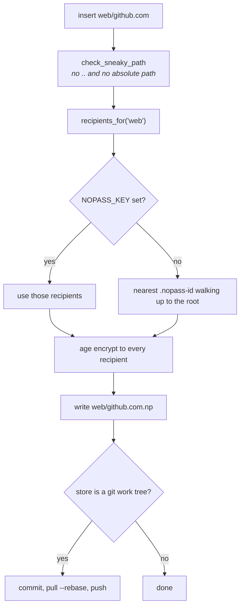

An entry body is one line of password followed by free-form `key: value` lines.
The conventional keys are what the browser side reads:

```
9x!Kd2pQvr4TmZ
username: sana@example.com
url: https://github.com
otpauth://totp/github?secret=…
```

| Key | Recognised spellings | Used for |
|---|---|---|
| password | *the first line* | fill, copy |
| username | `username`, `user`, `login`, `email` | the row label, the username field |
| url | `url`, `website`, `site` | origin matching, the detail screen |
| totp | `totp`, `otp`, `otpauth`, `otp_secret`, or a bare `otpauth://` line | the detail screen |

A value carrying a newline could forge a second line — a `url:` pointing
somewhere the user never typed, which is a phishing primitive rather than a
formatting bug. Both sides of the wire refuse one (ADR-0006).

---

## 4. Identity, slots and crypto

Encryption is public-key, so **writing needs no secret**. That single fact is
what makes the extension's create-only write possible at all (ADR-0006).

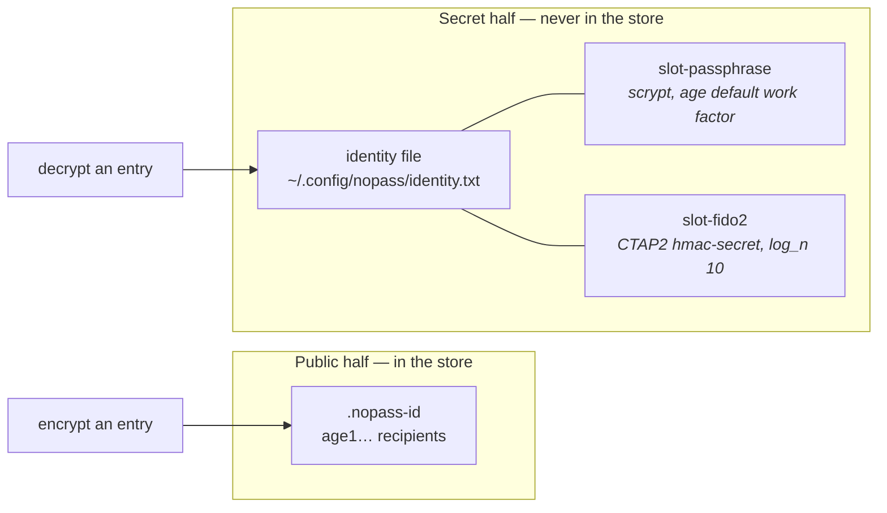

- **Backend** is pluggable: `NativeCrypto` (age X25519 + ChaCha20-Poly1305,
  in-process, the default), `GpgCrypto` (shell out to gpg), `PlainCrypto`
  (tests only, warns loudly).
- **Slots** are the disk-encryption key-slot model: each slot is an independent
  age scrypt ciphertext of the *same* identity secret. Any one slot opens it,
  and slots are added or removed independently.
- A security key's HMAC output is already a uniform 256-bit key, so its slot
  uses a low scrypt work factor; stretching full entropy buys latency and
  nothing else. Passphrase slots keep age's calibrated default.
- Generated passwords come from the OS CSPRNG, drawn uniformly from an ASCII
  charset, in `nopass-core::generate` — one generator behind `nopass generate`,
  `insert --generate` and the popup's **Generate** button.

---

## 5. Unlocking and the agent

There is exactly one unlock state on the machine, and the browser shares it
with the terminal (ADR-0005).

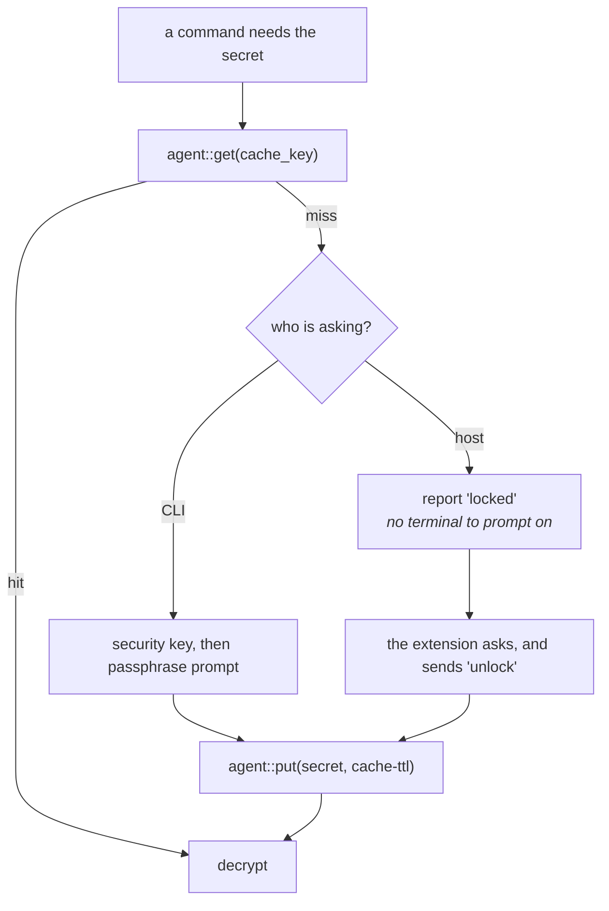

- The cache key is a SHA-256 digest of the `LockedIdentity` exactly as it sits
  on disk. Re-locking the identity rewrites that file, so an old cache entry
  stops matching rather than outliving the passphrase that made it.
- The agent listens on a unix socket under `XDG_RUNTIME_DIR` — `TMPDIR` on
  macOS — in a directory created 0700, never adopted. A machine with nowhere
  private gets no cache at all rather than one the neighbours can bind to.
- Nothing about the cache touches disk. Entries expire against the wall clock,
  so a laptop that sleeps for the night wakes with an empty cache.
- `cache-ttl` defaults to **0**: no caching, and the extension asks every time
  until the user configures one.
- Reads may use the cache. Anything that changes the store asks the user
  directly, so a warm cache never authorises a write.

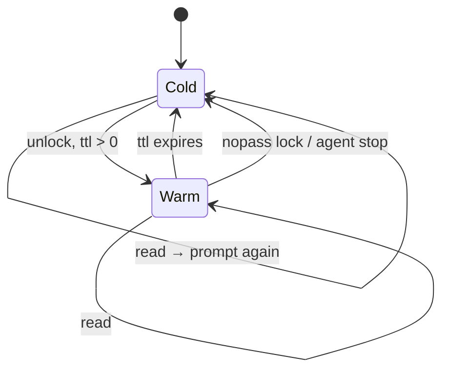

---

## 6. The CLI

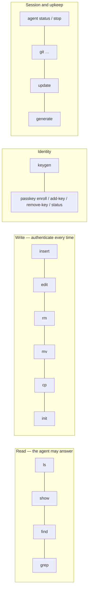

`store.authenticate()` gates the write group. It is a program check that the
person at the keyboard is the owner — not cryptography, because anything running
as the user can encrypt to the public key regardless. It defends a borrowed
terminal, not a compromised account.

---

## 7. The wire between browser and host

Native messaging, chosen over a localhost server so there is no port to find,
no origin to spoof, and no service running when the browser is closed
(ADR-0001).

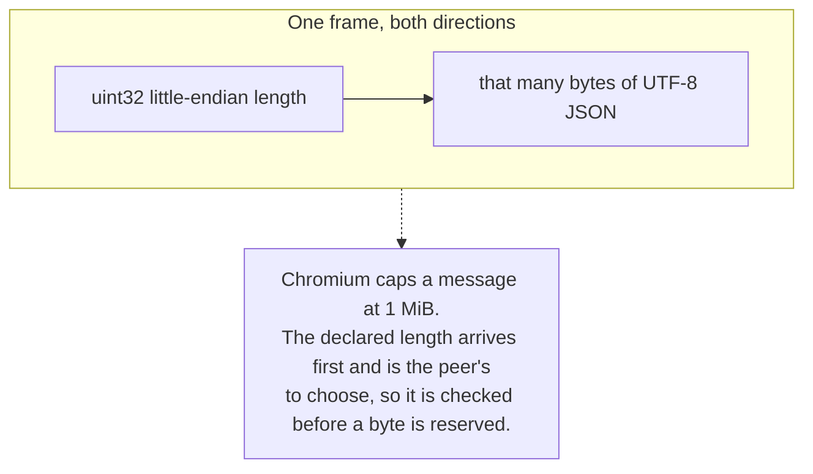

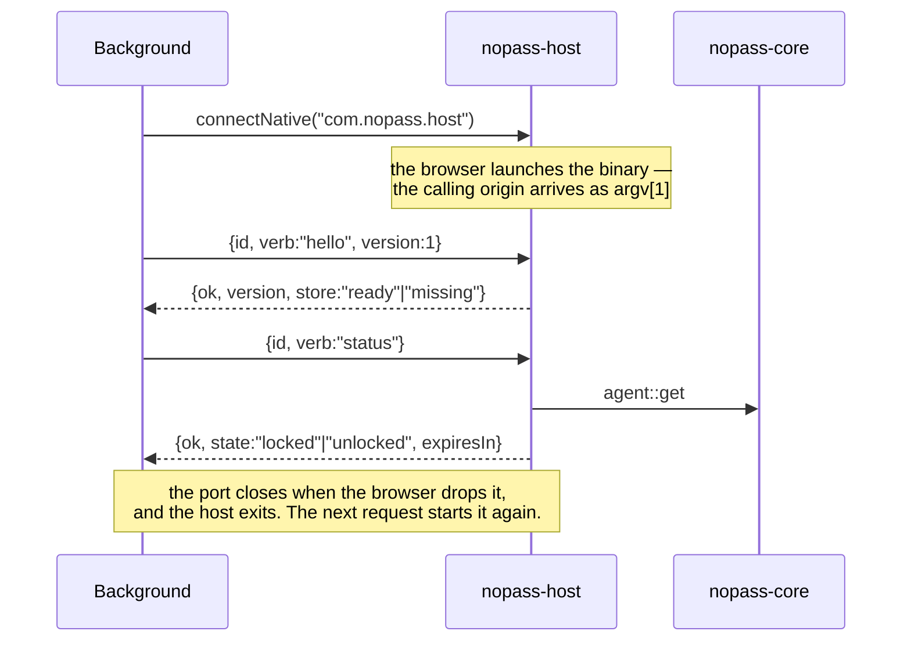

### Verbs

| Verb | Carries | Returns | Who may ask |
|---|---|---|---|
| `hello` | protocol version | version, whether a store exists | popup, content |
| `status` | — | lock state, seconds left | popup, content |
| `unlock` | passphrase | new lock state | popup only |
| `lock` | — | locked | popup only |
| `list` | — | every entry name, **no secret** | popup only |
| `search` | origin | matching names + username + url, **no secret** | popup, content |
| `get` | entry name | one secret, for one fill | popup; content only via a fill it cannot read |
| `generate` | length, symbols | a fresh password, **not stored** | popup only |
| `insert` | name, password, username?, url? | the name created | popup, and the save prompt (ADR-0007) |

Refused at the protocol layer, with a typed `read_only` error and a test that
says so: `edit`, `rm`, `remove`, `delete`, `mv`, `rename`, `cp`, `copy`, `init`,
`generate_into`. There is no shape of request this host accepts that reaches an
entry already in the store (ADR-0002, ADR-0006).

`insert` is allowed only when the store is **unlocked** and the name is
**free**. An overwrite is the reason a write path would be worth attacking —
replacing `web/bank.example` with a password the attacker knows turns a
disclosure bug into an account takeover — so it is refused with `exists`.

---

## 8. Inside the extension

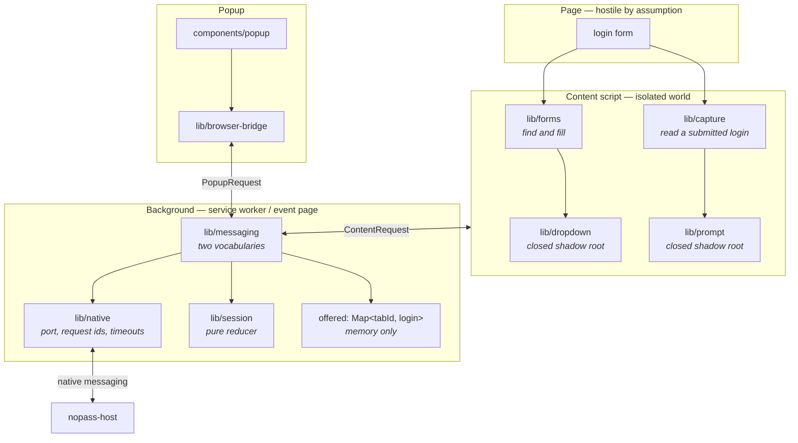

Two vocabularies, and the narrower one is deliberate:

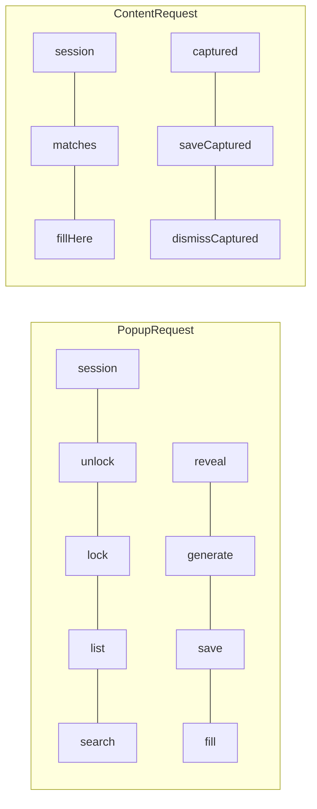

A content script can cause a fill but is never handed a secret to read; it
cannot enumerate the store; and it has no `save` — what it can do is *offer* a
login the user just submitted, and then *name* one the background is already
holding for its own tab (ADR-0007). Every tab-scoped request takes its tab id
from `sender`, never from the message, so a tab can only ever act on itself.

Replies go back through `sendResponse` with the listener returning `true`.
Returning a promise is a Gecko extension Chromium has never implemented: there
the channel closes as the listener returns and every caller resolves with
`undefined`.

### What the extension believes about the store

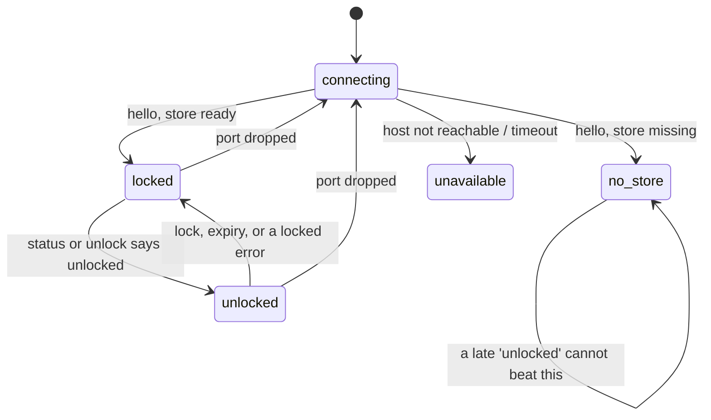

The host is the authority; this reducer only remembers what it last said. When
in doubt it prefers *locked* — showing entries and taking them away is worse
than a redundant unlock prompt.

---

## 9. The three flows that matter

### Fill from the inline dropdown

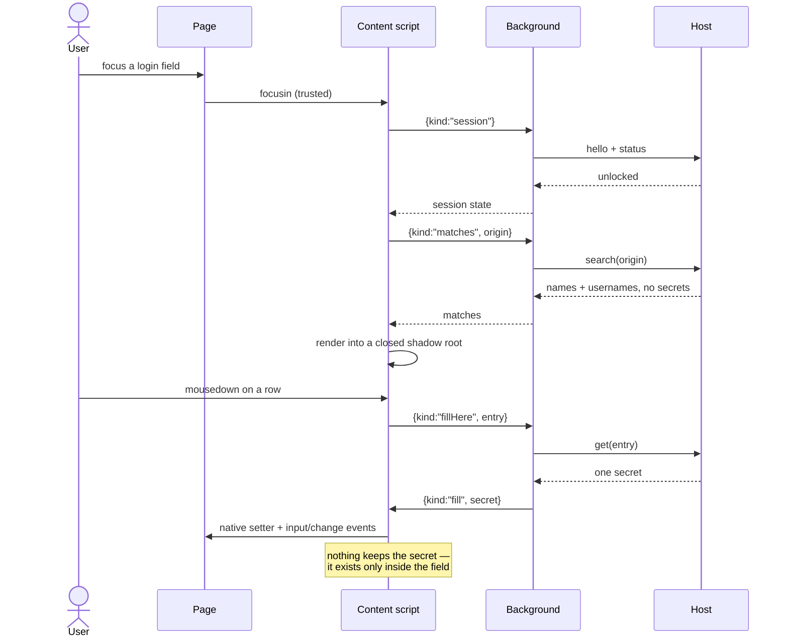

The dropdown opens because the user put their cursor in a field. A page cannot
ask for it, cannot read the shadow root, and cannot restyle it into something
that looks like part of the page.

### Unlock from the popup

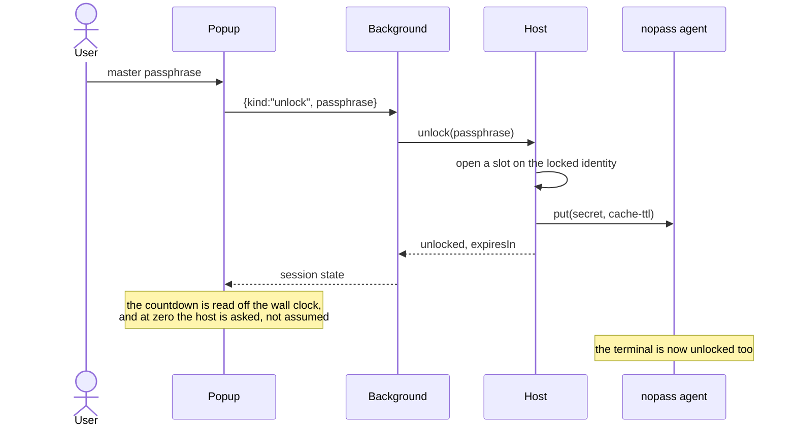

### Save a login after signing in

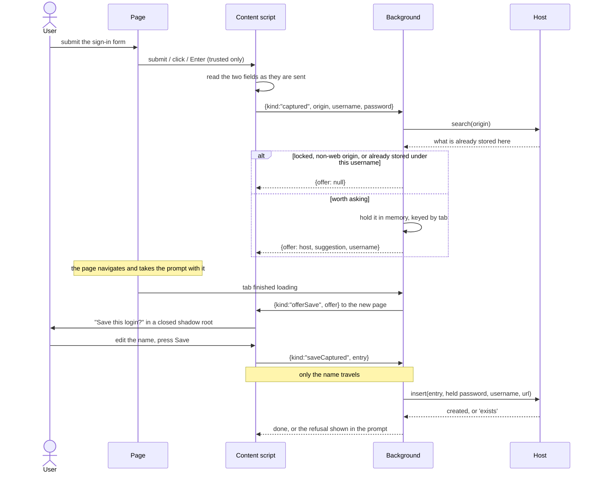

Nothing is written until the user names it. Closing the tab, or **Not now**,
throws the held login away.

---

## 10. Who may be offered what

Origin matching runs in the host, not the extension, so a compromised content
script cannot widen it.

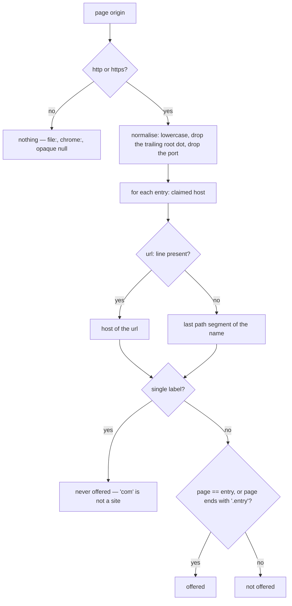

| Entry host | Page host | Offered |
|---|---|---|
| `google.com` | `google.com` | yes |
| `google.com` | `mail.google.com` | yes |
| `google.com` | `google.com.evil.tld` | no |
| `google.com` | `notgoogle.com` | no |
| `mail.google.com` | `google.com` | no |
| `com` | anything | no |

Name and `url:` line are matched independently, and either is enough:
`work/intranet` with `url: https://portal.example.org` is offered on that
portal, and `web/github.com` is offered on GitHub with no `url:` line at all.
It is a label-boundary suffix check, not a public-suffix lookup — no list is
compiled in.

---

## 11. Trust boundaries

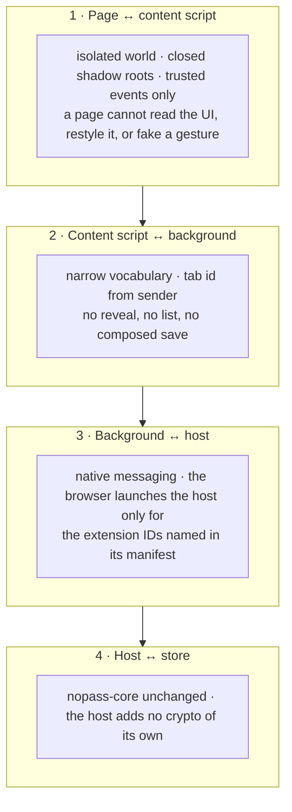

What each level buys an attacker who owns it:

| Attacker owns | Can do | Cannot do |
|---|---|---|
| The web page | Put values in its own fields; raise a save prompt naming its own host, which the user declines | Read the dropdown or the prompt, cause a fill, reach the isolated world, read any secret |
| The content script | Cause a fill into its own tab; look up which entries match its own origin | Read a secret, list the store, save something the user did not submit, act on another tab |
| The extension | Everything the popup can: read entries while unlocked, and create new ones | Alter or delete anything in the store; obtain the passphrase, which never enters the browser |
| The user's account | Everything — nopass defends a borrowed terminal, not a compromised account | — |

Names are file names, so **entry names are not encrypted**. The threat model
for confidentiality is unchanged from the CLI's.

---

## 12. The decision log

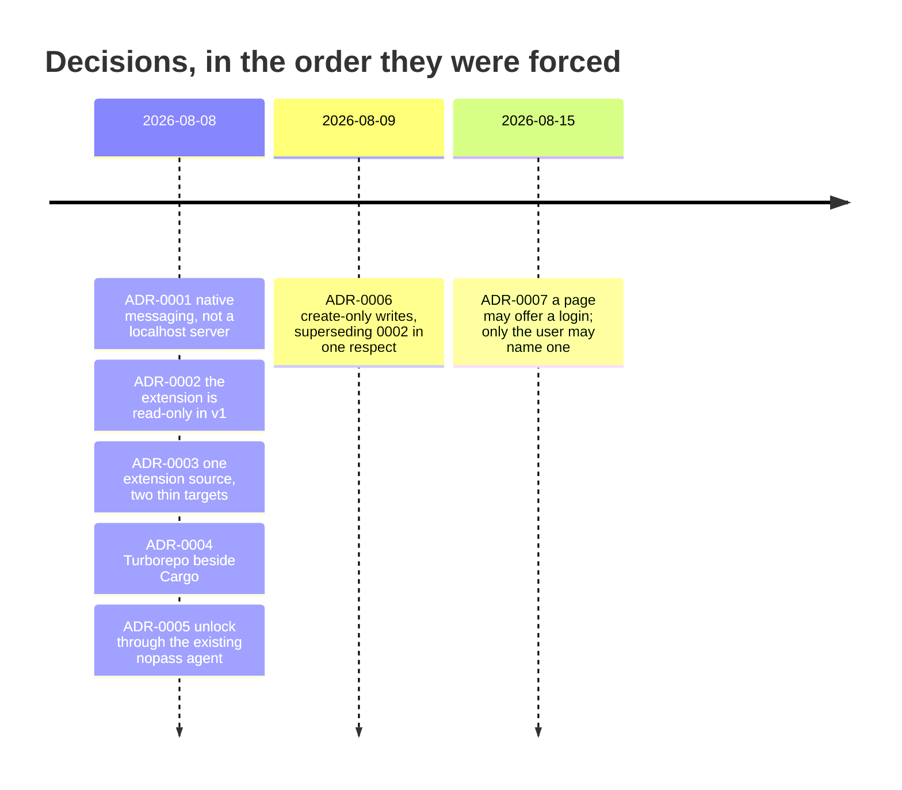

| ADR | Decision | What it bought | What it cost |
|---|---|---|---|
| [0001](docs/adr/0001-native-messaging-transport.md) | The browser launches `nopass-host` and speaks length-prefixed JSON on stdio | No port, no origin to spoof, nothing running when the browser is closed | A per-browser manifest to install, and an ID to register |
| [0002](docs/adr/0002-read-only-extension-v1.md) | No mutating verb exists on the wire | The wire could not reach an existing entry, by construction | Saving finished in a terminal — the complaint that produced 0006 |
| [0003](docs/adr/0003-shared-extension-source.md) | All logic in `packages/extension`; `tools/chrome` and `tools/firefox` hold only what genuinely differs | One place to fix a bug; the same UI in both browsers | Divergence has to be expressed in config, not copies |
| [0004](docs/adr/0004-turborepo-beside-cargo.md) | A Bun workspace beside the Cargo workspace, Turbo wrapping both | `turbo run test` at the root covers both languages | Two dependency graphs to keep installed |
| [0005](docs/adr/0005-unlock-via-nopass-agent.md) | The host reads and writes the same agent the CLI uses | One unlock state and one place to audit; `nopass lock` locks the browser too | `agent.rs` had to move from the CLI into core |
| [0006](docs/adr/0006-create-only-writes-from-the-extension.md) | One mutating verb, `insert`, gated on unlocked + name free | "Save this login" became possible without the passphrase entering the browser | A compromised extension can add junk entries |
| [0007](docs/adr/0007-saving-a-login-from-the-page.md) | A content script may offer a captured login and name one; it may not compose a save | The prompt appears at the moment the login is typed, where it belongs | Three more words in the content script's vocabulary |

Two decisions were made the same way and are worth reading as a pair: ADR-0002
rejected writing because nopass authenticates every mutation and a native host
has no terminal to prompt on; ADR-0006 found that reasoning holds only for verbs
that **decrypt**. Creating needs the recipients' public keys and nothing else.
`edit` and `rm` still decrypt, so they are still refused, and ADR-0002's answer —
a native OS prompt — is still the one waiting for them.

---

## 13. Build, test, release

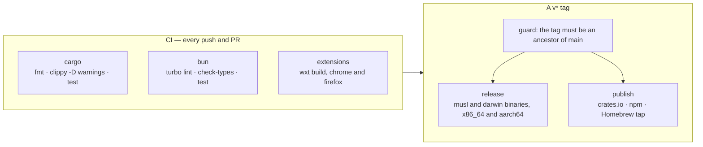

Where each layer is tested:

| Layer | Covered by |
|---|---|
| Store, crypto, slots, agent | `cargo test -p nopass-core` |
| CLI behaviour end to end | `crates/nopass-cli/tests/cli.rs` |
| Framing, dispatch, refusals, origin matching | `crates/nopass-host/tests/` |
| The wire contract, both sides | `packages/protocol/fixtures/messages.json` + `crates/nopass-host/tests/contract.rs` |
| Form finding, capture, dropdown, prompt, session reducer | `packages/extension/test/` (vitest, happy-dom) |
| The popup as a user drives it | `tools/workbench/e2e/` (Playwright, real components, mock bridge) |

Distribution: crates.io, npm, Nix, a Homebrew tap, and prebuilt binaries on the
release. Four channels and no more — each extra one wanted an account, a review
queue, or a second set of checksums to keep in step.

---

## 14. Invariants

The things that must stay true. If a change breaks one, it needs an ADR, not a
patch.

1. **The master passphrase never enters the browser process** except as the
   argument to an explicit `unlock` the user typed into the popup.
2. **Nothing on this wire can reach an entry that already exists.** Create only,
   refused by name at the protocol layer, with a test.
3. **A page script can never cause a fill, a read, or a write.** Only a trusted
   user gesture in the extension's own UI can.
4. **A content script is never handed a secret it can read**, and never learns
   what is in the store beyond its own origin's matches.
5. **Tab-scoped requests take their tab id from `sender`.**
6. **Origin matching happens in the host.**
7. **The agent holds secrets in memory only**, expiring against the wall clock,
   in a directory only its owner can reach.
8. **Reads may use a warm cache; writes ask the user.**
9. **The fixtures are the contract.** Neither language may move the wire alone.
10. **`packages/extension` is the extension.** A browser target may hold only
    what genuinely differs between browsers.
