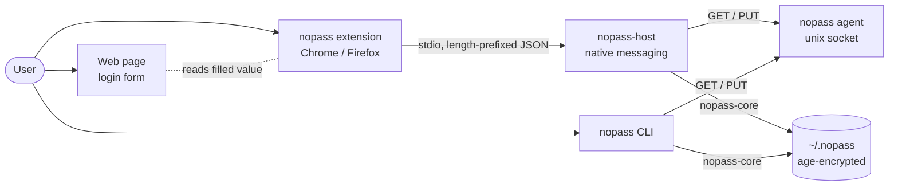
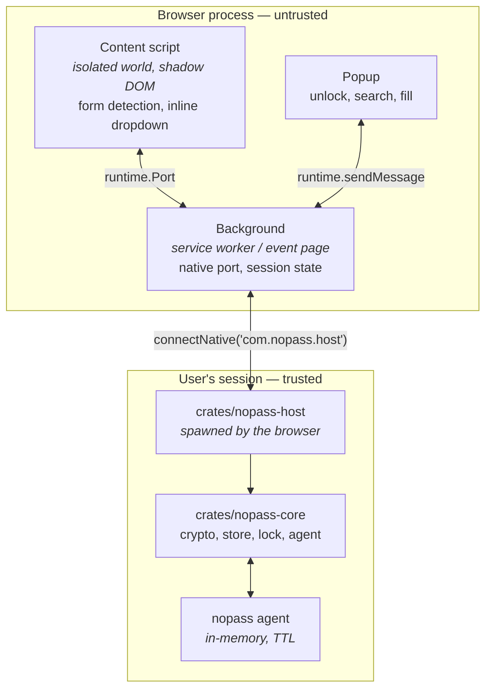

# nopass browser bridge — architecture

How a page in Chrome or Firefox ends up with a password out of an age-encrypted
store on disk, and what is trusted at each step.

The decisions behind this shape are recorded in [`docs/adr/`](../adr/README.md).
Read those for the *why*; this document is the *what*.

## System context



The extension is the only new *untrusted* component. It never holds an identity
and never sees the store. The host is trusted to the same degree as the CLI,
because it is the same library.

## Containers



## The wire

Native messaging frames are a `uint32` little-endian byte length followed by
that many bytes of UTF-8 JSON. Both directions. The host caps inbound frames the
way `nopass agent` caps `MAX_REQUEST`, so a bad length cannot ask it to allocate
freely.

The message shapes live in `packages/protocol` as Zod schemas and in
`crates/nopass-host` as serde types. Neither is the source of truth — the JSON
fixtures under `packages/protocol/fixtures/` are, and both sides are tested
against them, so the contract cannot drift silently.

### Verbs (v1)

| Verb | Direction | Purpose |
|------|-----------|---------|
| `hello` | ext → host | version handshake; host replies with protocol version and store status |
| `status` | ext → host | locked / unlocked, seconds remaining |
| `unlock` | ext → host | passphrase; host unlocks and warms the agent |
| `lock` | ext → host | drop the agent cache |
| `list` | ext → host | entry names only, never secrets |
| `search` | ext → host | entry names matching a host/origin |
| `get` | ext → host | one entry's secret, for one fill |
| `generate` | ext → host | a new password; **not** stored (ADR-0002) |

Mutating verbs — `insert`, `edit`, `rm`, `mv`, `cp` — are rejected at the
protocol layer. That rejection is a test.

## Trust boundaries

1. **Page ↔ content script.** The content script runs in an isolated world and
   renders its UI in a closed shadow root, so page scripts can neither read the
   dropdown nor style it into something else. A page can never initiate a fill;
   only a user gesture in the extension's own UI can.
2. **Content script ↔ background.** The content script is the most exposed part
   of the extension. It receives a secret only in response to a fill the user
   asked for, applies it, and drops it. It never receives the entry list.
3. **Background ↔ host.** The only place a passphrase is transmitted, and only
   on an explicit unlock (ADR-0005). The browser will only launch the host for
   the extension IDs named in the host's native messaging manifest.
4. **Host ↔ store.** `nopass-core`, unchanged. The host adds no crypto.

## Origin matching

An entry is offered on its own host and on hosts beneath it, and nowhere else.
The rule is a label-boundary suffix check, not a public-suffix lookup: no list
is compiled in, and an entry whose host is a single label is never offered at
all, so `com` cannot match every `.com`.

| Entry host | Page host | Offered |
|------------|-----------|---------|
| `google.com` | `google.com` | yes |
| `google.com` | `mail.google.com` | yes |
| `google.com` | `google.com.evil.tld` | no |
| `google.com` | `notgoogle.com` | no |
| `mail.google.com` | `google.com` | no |
| `com` | anything | no |

The entry's host comes from its `url:` line if it has one, otherwise from the
last path segment of its name — the `web/google.com` convention. Matching runs
in the host, not the extension, so a compromised content script cannot widen
it. Non-`http(s)` origins — `file:`, `chrome:`, extension pages, opaque `null`
— produce no host and therefore no matches.

`search` filters on names before decrypting anything, so an entry that is only
discoverable through its `url:` line will not be found by origin. Name your
entries after their host, or search by name in the popup.

## Repository layout

```
Cargo.toml               cargo workspace
package.json             bun workspace: packages/*, tools/*
turbo.json               task graph over both

crates/
  nopass-core/           crypto, store, lock, agent      (agent moved here, ADR-0005)
  nopass-cli/            the nopass binary
  nopass-host/           native messaging host           (new)

packages/
  protocol/              Zod schemas + shared JSON fixtures
  ui/                    shadcn/ui components, shared
  extension/             all extension logic and UI      (ADR-0003)

tools/
  chrome/                WXT target: MV3 service worker, pinned key
  firefox/               WXT target: MV3 event page, gecko id
  workbench/             React app rendering the extension UI with mock data
```

## Testing strategy

Tests are written before the code they cover, at four levels:

| Level | Tool | Covers |
|-------|------|--------|
| Contract | vitest + `cargo test` over shared fixtures | the wire protocol, both sides |
| Unit (Rust) | `cargo test` | host framing, verb dispatch, mutation rejection, origin matching |
| Unit (TS) | vitest + `wxt/testing/fake-browser` | session state machine, form detection, messaging |
| End to end | Playwright against `tools/workbench` | unlock → search → fill → lock, driving the real `Popup` and the real dropdown renderer over a mock bridge |

The native messaging hop itself is **not** in the e2e suite. Chrome and Firefox
read host manifests from fixed per-user OS paths rather than from a browser
profile, so exercising a real `connectNative` in CI would mean writing into the
developer's own configuration directory. What that hop carries is covered
instead from both ends: `crates/nopass-host`'s integration tests drive real
frames through real dispatch, and the shared fixtures pin the contract the
extension's `NativeClient` is validated against. What is untested is the glue
between them — the `connectNative` call itself — which is four lines and fails
loudly and visibly when it is wrong.
